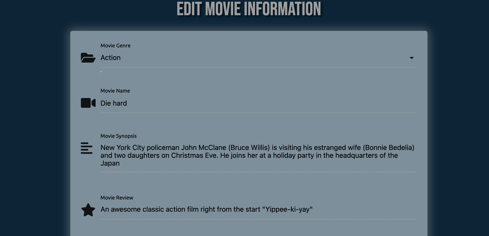

# Milestone Project Three | Movie Review

[View the live project here]()  

## About

This website has been created for my Milestone 3 Datacentric Development project. 
As a movie fan myself and after speaking with my mentor, I decided I would like to create a site where users can add and browse movie reviews of all genres. Using the CRUD functionality they will be able to create their own account. From here they can add, edit and delete their own reviews. As well as read the reviews from other users. 

## Contents

## User Experience-(UX)

### Site Goals

  1. I want the site to be attractive, responsive and easy to navigate for the user.
  2. I want the purpose of the site to be clear to the user
  3. I want the user to be able to create, edit and delete their own movies.
  4. I want their to be an admin account where they can edit, delete and add new genres.
  5. I want the user to be able to register an account, login, logout and delete it if they wish. 

### User Stories
  
  * #### First Time Visitor Goals
    1. I want the site to be attractive and and easy to navigate.
    2. I want the site to be responsive to whichever device I am viewing it on.
    3. I want to understand clearly what the site is for.
    4. I want to be able to register an account easily
    5. I want to be able to view other peoples reviews
    6. I want to be able to search for existing reviews.

  * #### Returning Visitor Goals
    1. I want to be able to login to my account easily for full access of the site.
    2. I want to be able to add my own reviews.
    3. I want to view all my existing reviews through my own profile page.
    4. I want to be able to edit and delete my existing reviews.
    5. I want to follow the site through their social links. 

  * #### Admin Goals
    1. As an admin of the site I Wwould like full access to all pages
    2. I would like to be able to add, edit or delete any genre categories 

### Design

* When considering the design for this project it was important to take in to account the target audience. But very quickly I realised that a site like this doesn't really have any particulart target. Movies appeal to all people from all backgrounds of all ages. So with this in mind I wanted to create a look that just used visually appealing colors that contrast each other nicely and let all the main features of the site stand out and be clear to see for the user. 
* By giving the option to add an image to the users reviews it really helps to make the page stand out and be clear for the user which film they are reading about. 
* For the home page I wanted it to feel like an up to date movie review site so decided to add a video trailer of the biggest film out right now. I feel this instantly draws the user in and gives them the cinematic feeling all us movie fans enjoy.

  * #### Wireframes

  To create my wireframes I used balsamiq. I have done a design for both large and smaller screens to show how the layout of the site will change accordingly with different screen sizes. The links to the wireframes are below.  
  * [Large screens](https://github.com/Ashb87/Ms3-Movie-Review/blob/main/assets/wireframes/Movie-review-large.png)
  * [Smaller screens]() 

  The majority of the site has been kept very similar to the design of my wireframes. The main difference is on the *movie review page.* After speaking with my mentor he advised it would be better to have all the movie cards on one page with minimal information, and then open the full review for each individual review on a separate page. By doing this it has reduced the amount of scrolling needed on the movie review page as it is more condensed and much more user friendly. I also like the way the full review opens up on a separate page and think it gives a more professional feel to the site.

  * #### Imagery

  For the design of the site I have only used two images. Both quite small and only used as background images. One for the home page and one on the movie review page. For the home page it is used as the hero image and is a picture of red theatre/movie curtains. Set as a backdrop for some text. For the review page the image is used as the background for the search bar where the user can search for a movie title or genre. It has a backdrop filter over the picture to make the text stand out more making it easier for the user to read.  
  As well as these two images the user also has the option to add an image url so they can add a picture to their review. These are all set to a matching size with the same border radius, so that with every review added they all look the same and sit uniformly on the page. If the user doesn't add their own image then I have a default image set to be inserted instead, again with a matching size and border radius. 

  * #### Color scheme

  For the colors on my project I first went to [coolors.co](https://coolors.co/) to use their palette generator. I had an idea of wanting to use a dark blue for the majority of my site and so used the generator to find colors that would match up well. From this I found a palette that hard a dark blue, a shade of red and a yellow. From here I then used the google color picker to fine tune the exact shades of each color I wanted. I thinkthe colors all work really well together and give the look I was going for to suit the movie feel of the site. 
  For a contrast I used a grey for the footer of the site and also for some of the headings across the different pages. This gives the footer more of a distinctive look and differentiates it from the rest of the site. Whilst also sitting nicely against the dark blue.

   

  * #### Typography

  I have used two fonts across the site both imported from google fonts. They are **bebas neue** and **ubuntu**. The Ubuntu font has been usded for the majority of the text across the site while the Bebas neue font has been used for the headings across the pages. The bebas neue font is displayed in all capitals so works well for the headings. I then wanted another font to sit nicely with the bebas neue and be easy and pleasing to read for the user. I found the ubuntu font and after trying a couple of others felt this font worked well with the look of the site. 

## Features

  * ### Across All Pages
    * Responsive Fixed Nav bar at the top that collapses to burger icon for smaller screens and has blurred effect when page is scrolled behind it. If the user is logged in they will have the options of *home* *movies* *profile* and *logout* If they are not signed in they will have the options of *home* *movies* *login* and *register*
    * Footer with social links opening each one in a new browser.

  * ### Home Page
    * Embedded video from youtube displaying a recent movie trailer to give the effect of an upto date site. Video is responsive to all screen sizes.
    * If user is logged out there is a button under the video that links the user to the login page or if not yet registered then they can link to the register page. If logged in they will instead have the option to add a movie review.
    

  * ### Login/Register Page
    * For the register page the user will be required to create a username with a minimum of 5 characters. And then a password, again minimum of 5 characters. They will need to add the password twice for extra security with the register button being disabled until they match.
    * For the login page they will be required to input their username and password.
    * For both the login and registered pages a flash message will be displayed when user is successful in loggin in or registering.

  * ### Movie Page
    * At the top of the page there is a search bar where the user can look for a movie either by its name or genre.
    * For users not logged in there is a button giving them the option to log in allowing them to add a review.
    * For logged in users this buttin becomes an *add movie button* linking them to the add movie form.
    * Each review already added is then displayd underneath. showing the name of the movie, an image, if provided and who created the review. Within each movie card is a button linking the user to the full review of that specific movie. If they are not logged in they will be prompted to do so before viewing the full review.

  * ### Full Review Page 
    * On this page the user can see the film title with an image card if provided. Then they will be able to see the genre, a movie synopsis, the users review, a rating out of 5 and who the review was added by.
    * A link back to the movie page.

  * ### Profile Page
    * A card panel at the top with the users username displayed and a button that links to the add movie review form.
    * If the user has no reviews there will be a heading saying no reviews yet. Otherwise their reviews will be displayed below, showing the movie title, the image provided or default image and then two buttons. One linking them to the edit review page. The other is delete review button. If they click this they will be prompted my a modal to either confirm or canel their choice to delete the review.
    * At the bottom below their reviews they will have the option to delete their account. Again prompted by a modal to confirm oor cancel their decision.

  * ### Add/Edit Movie Page
    * For the add movie page a form is displayed for the use to fill out. There is a dropdown option for the user to pick a genre. They will then need to fill in the movie name, movie synopsis, and their review of the movie. They will then have the option to add an image url and finally pick a star rating out of 5. Once all filled in they can then click the add movie buton and their review will appear on the movie page.
    * For the edit movie page it will be the same as above with the input fields already filled with previously given information. They can then change what they like on the review and click *confirm edit* or cancel their changes by clicking on the *cancel changes* button. 

  * ### Features for Admin
    * When user is logged in as Admin they will have the added option on their menu to manage genres. From here they will be able to add new ones, edit or delete exisiting ones.
    * Admin will also have the ability to delete any review posted by any user if they feel it is necessary.  

## Features to implement in the future
To take this site further, with more knowledge and time there would be a few elements I would like to add to the project.
  * Allow user to add a profile image to their account.
  * Allow the user to edit their username or password
  * Allow more than one Admin by not just using the Admin username.
  * Using emailJS give the user the option to signup to a news letter and recieve emails relevant to the site.
  * Allow any user to add a further review to any review already added on the site.
  * limit how many reviews are displayed on a page before user can click to go to a next page rather than keep scrolling. 

## Technologies used

### Languages used

  * [HTML5](https://developer.mozilla.org/en-US/docs/Web/Guide/HTML/HTML5)  
  * [CSS3](https://developer.mozilla.org/en-US/docs/Web/CSS)  
  * [JavaScript](https://developer.mozilla.org/en-US/docs/Web/JavaScript)  
  * [Python](https://www.python.org/)

### Frameworks, Libraries and Programs Used

  * [Materialize](https://materializecss.com/) 
    Materialize was used to help build the structure of the website and add responsiveness across different screen sizes.
    It also supplied some styling and built in components such as the modal.
  * [Balsamiq](https://balsamiq.com/)  
     I used balsamiq to design and draw up my wireframes before starting the project.
  * [Google Fonts](https://fonts.google.com/)  
     Google fonts was used throughout the project to import my selected fonts.
  * [Font Awesome](https://fontawesome.com/)  
      Font awesome was used to add all icons used on the site.
  * [Gitpod](https://www.gitpod.io/)  
     Gitpod was the text editor I used for this project.
  * [Git](https://git-scm.com/)  
     Git is used as version control software to add, commit and push code to my GitHub repository where the code is then stored.
  * [GitHub](https://github.com/)  
     I have used GitHub as a remote repository to push and store the committed changes to my project from Git.
  * [jQuery](https://jquery.com/)  
     jQuery was used to initialize Materialize and for some of the sites functionality.
  * [Google Chrome Developer Tools](https://developer.chrome.com/docs/devtools/)  
     I have used Google chromes built in developer tools to help with the styling of the site, selecting colors and to help fix any bugs I found.
  * [Heroku](https://id.heroku.com)  
     Heroku has been used to deploy my live site.
  * [Flask](https://en.wikipedia.org/wiki/Flask_(web_framework))  
     Flask was used as the web framework for the application.
  * [MongoDB](https://www.mongodb.com/)
     MongoDB was used to hold the database for my project.
  * [Werkzeug](https://werkzeug.palletsprojects.com/en/2.0.x/)  
     Werkzeug was used for password hashing and authentication.
  * [Jinja](https://jinja.palletsprojects.com/en/3.0.x/)  
     Jinja templating language was used to simplify and display backend data in HTML.
  * [coolors.co](https://coolors.co/)  
     Coolors was used. to help find the color palette I wanted for my project.

## Testing

### Testing User Stories and Site Goals

  **1. I want the site to be attractive, responsive and easy to navigate for the user.**

  - To get feedback on the visual aspect of the project it has been shared with many friends and family and also other students of code institute via the slack portal. The feedback on the visual aspect has been really good with the choice of colors recieving positive reviews and many saying it has a good movie vibe to the look of the site.
  - I have tested the site on many differnet screen sizes, including, Iphone Xr, Iphone 12, Ipad mini, Samsung Galaxy tablet, Macbook air and IMac desktop.
  The site responds well to the different screen sizes and the layout adapts as intended. Using the materialize grid system as well as some custom styling has helped to achieve this. 
  - The navigation for the site has a clear and simple layout making it easy for the user to navigate through the different pages. With contrasting colours making all the different features clear and visible for the user to see.
  There are also many buttons placed on the different pages to help the user navigate around quicker rather than having to use the navbar or clicking on the back button everytime. 

  **2. I want the purpose of the site to be clear to the user**

  - When the user first sees the home page there is a hero image with a simple heading of *Love the big screen?* With some further text underneath explaining what the movie catalog is for. I think this gives a claer intention for the site. Across the pages there are further images displaying movie cards which help add to the feel of a movie site. 

    
   

  **3. I want the user to be able to create, edit and delete their own movies.**

  - When the user has created an account and is signed in they will then have the option to add their own movie and review.
  If they are not logged in they will be prompted to do so before being able to add a movie.  

    

  - When they are logged in they can click the *add movie* link and will be taken to the add movie form page.  

    

  From here they can add all the required fileds and add an optional image url and then click the add movie button. When submitted the mobvie will appear on the movies page along with all other added movies.  

     

  From these movie cards a user can either click on the image or the button to link them to the full information/review of that specific movie They do not need to be logged in to do this.  

     

  When a user is logged in they will be able to go to their profile page and see all movies they have already added. From here they will have the option to either edit or delete each specific movie. If they wish to edit the information they have provided they can click thebedit button and they will be directed to the edit movie form. This form will already be filled out with the information they had previously given. They can change any field they like and then click the confirm edit button and the new changes will be saved to the database and displayed on screen. With a flash message telling the user they have successfully edited their movie.  

     
     
     

  If the users wishes to delete a movie from their profile they can click the delete movie button. Doin so will display a modal asking the user if they definitely want to delete that movie. They can cancel or confirm in the modal. If they delete it they will have a flash message telling them they have successfully deleted their movie.  

     

  After lots of testing on differnet profiles and and by adding, editing and deleting lots of movies everything is working as expected.

  **4. I want their to be an admin account where they can edit, delete and add new genres.**

  - If the session user signed in is Admin then they will have the added option of adding, editing and deleting the genre selection availible for when users add their movies. If they wish to delete a genre they will be prompted by a modal to confirm their choice. When adding, editing and deleting they will be displayed with a flash message to tell them it has been successful. And this will then be changed in the database. I have been logged in as admin and tested each of these function many times and work as expected every time.  

     

  **5. I want the user to be able to register an account, login, logout and delete it if they wish.**

  - When a user visits the site they will have the option to register an account if they haven't already done so. When clicking the register link they will be directed to the register form. Here they will need to provide a username and a password. They will need to add the password twice and will not be able to submit the form until the passwords match. The register function will also check for existing usernames to make sure the one they are using doesn't already exist.  Once successfully registerd they will be directed to their profile page.  

     

  - Once registered, when returning to the site again they will be ablle to log back in to their profile by providing their username and password.  

     

  Once logged in they will be directed to their profile page. They can choose to log out if they wish by clicking the link. They will also have the option to delete their profile by clicking the button at the bottom of the page. If they click this they will be prompted by a modal to confirm their decision. If they go ahead and delete it they will be presented with a flash message and their information will be removed from the database.  

     

  - I have tested each of these functions many times across different devices and each work as expected. I have also checked each time with my collections on mongodb to see that the information is being stored or deleted as intended. Each time without and problems or issues. 

