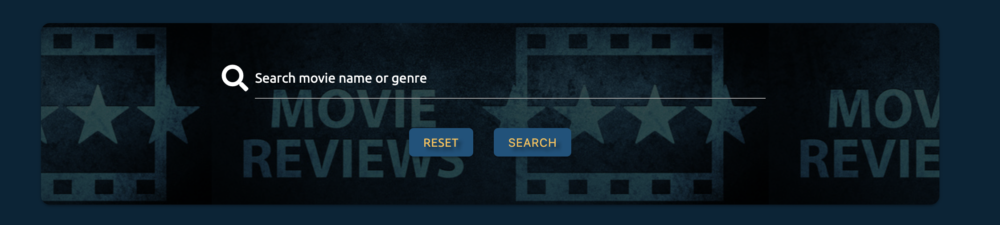
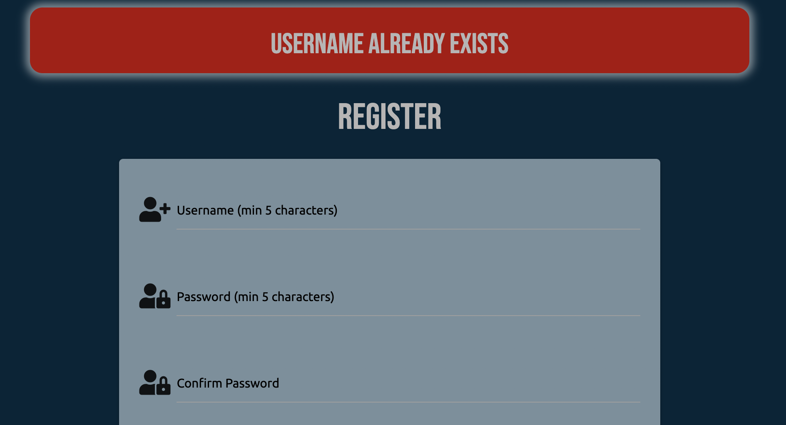

# Milestone Project Three | Movie Catalog

 

[View the live project here](https://ms3-movie-review.herokuapp.com/)  

## About

This website has been created for my Milestone 3 Datacentric Development project. 
As a movie fan myself and after speaking with my mentor, I decided I would like to create a movie catalog site where users can add and browse movies of all genres, giving snippets of information for each movie as well as a movie image, their own review and a star rating. Using the CRUD functionality they will be able to create their own account. From here they can add, edit and delete their own movies. As well as view movies added by other users.  

## Contents

  * [User Experience](#user-experience-ux)
    - [Site Goals](#site-goals)
    - [User Stories](#user-stories)
    - [Design](#design)
      - [Wireframes](#wireframes)
      - [Imagery](#imagery)
      - [Color Scheme](#color-scheme)
      - [Typography](#typography)
  
  * [Features](#features)
    - [Across all pages](#across-all-pages)
    - [Home Page](#home-page)
    - [Login/Register Page](#login-register-page)
    - [Movie Page](#movie-page)
    - [Full Review Page](#full-review-page)
    - [Profile Page](#profile-page)
    - [Add/Edit Movie Page](#add-edit-movie-page)
    - [Features for Admin](#features-for-admin)
  * [Future Features](#features-to-implement-in-the-future)

  * [Technologies Used](#technologies-used)
    - [Languages Used](#languages-used)
    - [Frameworks, Libraries and Programs](#frameworks-libraries-and-programs-used)

  * [Testing](#testing)
    - [Testing User Stories and Site Goals](#testing-user-stories-and-site-goals)
    - [Features Testing](#features-testing)
    - [Responsive Testing](#responsive-testing)
    - [Code Validators](#code-validators)
    - [Lighthouse Testing](#lighthouse-testing)
    - [Further Testung](#further-testing)
    - [Known Issues and Bugs](#known-issues-and-bugs)

  * [Deployment](#deployment)

  * [Credits](#credits)

## User Experience-(UX)

### Site Goals

  1. I want the site to be attractive, responsive and easy to navigate for the user.
  2. I want the purpose of the site to be clear to the user
  3. I want the user to be able to create, edit and delete their own movies.
  4. I want their to be an admin account where they can edit, delete and add new genres.
  5. I want the user to be able to register an account, login, logout and delete it if they wish. 

### User Stories
  
  * #### First Time Visitor Goals
    1. I want the site to be attractive and and easy to navigate.
    2. I want the site to be responsive to whichever device I am viewing it on.
    3. I want to understand clearly what the site is for.
    4. I want to be able to register an account easily
    5. I want to be able to view other peoples movies and reviews
    6. I want to be able to search for existing movies.

  * #### Returning/Frequent Visitor Goals
    1. I want to be able to login to my account easily for full access of the site.
    2. I want to be able to add my own movies.
    3. I want to view all my existing movies through my own profile page.
    4. I want to be able to edit and delete my existing movies.
    5. I want to follow the site through their social links. 

  * #### Admin Goals
    1. As an admin of the site I Wwould like full access to all pages
    2. I would like to be able to add, edit or delete any genre categories
    3. I would like to be able to delete any review from the site 

### Design

* When considering the design for this project it was important to take in to account the target audience. But very quickly I realised that a site like this doesn't really have any particulart target. Movies appeal to all people from all backgrounds of all ages. So with this in mind I wanted to create a look that just used visually appealing colors that contrast each other nicely and let all the main features of the site stand out and be clear to see for the user. 
* By giving the option to add an image to the users reviews it really helps to make the page stand out and be clear for the user which film they are reading about. 
* For the home page I wanted it to feel like an up to date movie review site so decided to add a video trailer of the biggest film out right now. I feel this instantly draws the user in and gives them the cinematic feeling all us movie fans enjoy.

  * #### Wireframes

  To create my wireframes I used balsamiq. I have done a design for both large and smaller screens to show how the layout of the site will change accordingly with different screen sizes. The links to the wireframes are below.  
  * [Large screens](https://github.com/Ashb87/Ms3-Movie-Review/blob/main/assets/wireframes/ms3-wireframe-large.png)
  * [Smaller screens](https://github.com/Ashb87/Ms3-Movie-Review/blob/main/assets/wireframes/ms3-wireframe-small.png) 

  The majority of the site has been kept very similar to the design of my wireframes. The main difference is on the *movie review page.* After speaking with my mentor he advised it would be better to have all the movie cards on one page with minimal information, and then open the full review for each individual review on a separate page. By doing this it has reduced the amount of scrolling needed on the movie review page as it is more condensed and much more user friendly. I also like the way the full review opens up on a separate page and think it gives a more professional feel to the site.

  * #### Imagery

  For the design of the site I have only used two images. Both quite small and only used as background images. One for the home page and one on the movie review page. For the home page it is used as the hero image and is a picture of red theatre/movie curtains. Set as a backdrop for some text. For the review page the image is used as the background for the search bar where the user can search for a movie title or genre. It has a backdrop filter over the picture to make the text stand out more making it easier for the user to read.  
  As well as these two images the user also has the option to add an image url so they can add a picture to their review. These are all set to a matching size with the same border radius, so that with every review added they all look the same and sit uniformly on the page. If the user doesn't add their own image then I have a default image set to be inserted instead, again with a matching size and border radius. 

  * #### Color scheme

  For the colors on my project I first went to [coolors.co](https://coolors.co/) to use their palette generator. I had an idea of wanting to use a dark blue for the majority of my site and so used the generator to find colors that would match up well. From this I found a palette that hard a dark blue, a shade of red and a yellow. From here I then used the google color picker to fine tune the exact shades of each color I wanted. I thinkthe colors all work really well together and give the look I was going for to suit the movie feel of the site. 
  For a contrast I used a grey for the footer of the site and also for some of the headings across the different pages. This gives the footer more of a distinctive look and differentiates it from the rest of the site. Whilst also sitting nicely against the dark blue.

   

  * #### Typography

  I have used two fonts across the site both imported from google fonts. They are **bebas neue** and **ubuntu**. The Ubuntu font has been usded for the majority of the text across the site while the Bebas neue font has been used for the headings across the pages. The bebas neue font is displayed in all capitals so works well for the headings. I then wanted another font to sit nicely with the bebas neue and be easy and pleasing to read for the user. I found the ubuntu font and after trying a couple of others felt this font worked well with the look of the site. 

## Features

  * ### Across All Pages
    * Responsive Fixed Nav bar at the top that collapses to burger icon for smaller screens and has blurred effect when page is scrolled behind it. If the user is logged in they will have the options of *home* *movies* *profile* and *logout* If they are not signed in they will have the options of *home* *movies* *login* and *register*
    * Footer with social links opening each one in a new browser.

  * ### Home Page
    * Embedded video from youtube displaying a recent movie trailer to give the effect of an upto date site. Video is responsive to all screen sizes.
    * If user is logged out there is a button under the video that links the user to the login page or if not yet registered then they can link to the register page. If logged in they will instead have the option to add a movie review.
    
  * ### Login-Register Page
    * For the register page the user will be required to create a username with a minimum of 5 characters. And then a password, again minimum of 5 characters. They will need to add the password twice for extra security with the register button being disabled until they match.
    * For the login page they will be required to input their username and password.
    * For both the login and registered pages a flash message will be displayed when user is successful in loggin in or registering.

  * ### Movie Page
    * At the top of the page there is a search bar where the user can look for a movie either by its name or genre.
    * For users not logged in there is a button giving them the option to log in allowing them to add a review.
    * For logged in users this buttin becomes an *add movie button* linking them to the add movie form.
    * Each review already added is then displayd underneath. showing the name of the movie, an image, if provided and who created the review. Within each movie card is a button linking the user to the full information and review of that specific movie. 

  * ### Full Review Page 
    * On this page the user can see the film title with an image card if provided. Then they will be able to see the genre, a movie synopsis, the users review, a rating out of 5 and who the review was added by.
    * A link back to the movie page.

  * ### Profile Page
    * A card panel at the top with the users username displayed and a button that links to the add movie review form.
    * If the user has no reviews there will be a heading saying no reviews yet. Otherwise their reviews will be displayed below, showing the movie title, the image provided or default image and then two buttons. One linking them to the edit review page. The other is delete review button. If they click this they will be prompted my a modal to either confirm or canel their choice to delete the review.
    * At the bottom below their reviews they will have the option to delete their account. Again prompted by a modal to confirm oor cancel their decision.

  * ### Add-Edit Movie Page
    * For the add movie page a form is displayed for the use to fill out. There is a dropdown option for the user to pick a genre. They will then need to fill in the movie name, movie synopsis, and their review of the movie. They will then have the option to add an image url and finally pick a star rating out of 5. Once all filled in they can then click the add movie buton and their review will appear on the movie page.
    * For the edit movie page it will be the same as above with the input fields already filled with previously given information. They can then change what they like on the review and click *confirm edit* or cancel their changes by clicking on the *cancel changes* button. 

  * ### Features for Admin
    * When user is logged in as Admin they will have the added option on their menu to manage genres. From here they will be able to add new ones, edit or delete exisiting ones.
    * Admin will also have the ability to delete any review posted by any user if they feel it is necessary.  

## Features to implement in the future
To take this site further, with more knowledge and time there would be a few elements I would like to add to the project.
  * Allow user to add a profile image to their account.
  * Allow the user to edit their username or password
  * Allow more than one Admin by not just using the Admin username.
  * Using emailJS give the user the option to signup to a news letter and recieve emails relevant to the site.
  * Allow any user to add a further review to any review already added on the site.
  * limit how many reviews are displayed on a page before user can click to go to a next page rather than keep scrolling. 

## Technologies used

### Languages used

  * [HTML5](https://developer.mozilla.org/en-US/docs/Web/Guide/HTML/HTML5)  
  * [CSS3](https://developer.mozilla.org/en-US/docs/Web/CSS)  
  * [JavaScript](https://developer.mozilla.org/en-US/docs/Web/JavaScript)  
  * [Python](https://www.python.org/)

### Frameworks, Libraries and Programs Used

  * [Materialize](https://materializecss.com/) 
    Materialize was used to help build the structure of the website and add responsiveness across different screen sizes.
    It also supplied some styling and built in components such as the modal.
  * [Balsamiq](https://balsamiq.com/)  
     I used balsamiq to design and draw up my wireframes before starting the project.
  * [Google Fonts](https://fonts.google.com/)  
     Google fonts was used throughout the project to import my selected fonts.
  * [Font Awesome](https://fontawesome.com/)  
      Font awesome was used to add all icons used on the site.
  * [Gitpod](https://www.gitpod.io/)  
     Gitpod was the text editor I used for this project.
  * [Git](https://git-scm.com/)  
     Git is used as version control software to add, commit and push code to my GitHub repository where the code is then stored.
  * [GitHub](https://github.com/)  
     I have used GitHub as a remote repository to push and store the committed changes to my project from Git.
  * [jQuery](https://jquery.com/)  
     jQuery was used to initialize Materialize and for some of the sites functionality.
  * [Google Chrome Developer Tools](https://developer.chrome.com/docs/devtools/)  
     I have used Google chromes built in developer tools to help with the styling of the site, selecting colors and to help fix any bugs I found.
  * [Heroku](https://id.heroku.com)  
     Heroku has been used to deploy my live site.
  * [Flask](https://en.wikipedia.org/wiki/Flask_(web_framework))  
     Flask was used as the web framework for the application.
  * [MongoDB](https://www.mongodb.com/)
     MongoDB was used to hold the database for my project.
  * [Werkzeug](https://werkzeug.palletsprojects.com/en/2.0.x/)  
     Werkzeug was used for password hashing and authentication.
  * [Jinja](https://jinja.palletsprojects.com/en/3.0.x/)  
     Jinja templating language was used to simplify and display backend data in HTML.
  * [coolors.co](https://coolors.co/)  
     Coolors was used. to help find the color palette I wanted for my project.

## Testing

### Testing User Stories and Site Goals

### Site Goals

  **1. I want the site to be attractive, responsive and easy to navigate for the user.**

  - To get feedback on the visual aspect of the project it has been shared with many friends and family and also other students of code institute via the slack portal. The feedback on the visual aspect has been really good with the choice of colors recieving positive reviews and many saying it has a good movie vibe to the look of the site.
  - I have tested the site on many differnet screen sizes, including, Iphone Xr, Iphone 12, Ipad mini, Samsung Galaxy tablet, Macbook air and IMac desktop.
  The site responds well to the different screen sizes and the layout adapts as intended. Using the materialize grid system as well as some custom styling has helped to achieve this. 
  - The navigation for the site has a clear and simple layout making it easy for the user to navigate through the different pages. With contrasting colours making all the different features clear and visible for the user to see.
  There are also many buttons placed on the different pages to help the user navigate around quicker rather than having to use the navbar or clicking on the back button everytime. 

  **2. I want the purpose of the site to be clear to the user**

  - When the user first sees the home page there is a hero image with a simple heading of *Love the big screen?* With some further text underneath explaining what the movie catalog is for. I think this gives a clear intention for the site. Across the pages there are further images displaying movie cards which help add to the feel of a movie site. 

    
   

  **3. I want the user to be able to create, edit and delete their own movies.**

  - When the user has created an account and is signed in they will then have the option to add their own movie and review.
  If they are not logged in they will be prompted to do so before being able to add a movie.  

    

  - When they are logged in they can click the *add movie* link and will be taken to the add movie form page.  

    

  From here they can add all the required fileds and add an optional image url and then click the add movie button. When submitted the mobvie will appear on the movies page along with all other added movies.  

     

  From these movie cards a user can either click on the image or the button to link them to the full information/review of that specific movie They do not need to be logged in to do this.  

     

  When a user is logged in they will be able to go to their profile page and see all movies they have already added. From here they will have the option to either edit or delete each specific movie. If they wish to edit the information they have provided they can click thebedit button and they will be directed to the edit movie form. This form will already be filled out with the information they had previously given. They can change any field they like and then click the confirm edit button and the new changes will be saved to the database and displayed on screen. With a flash message telling the user they have successfully edited their movie.  

     
     
     

  If the users wishes to delete a movie from their profile they can click the delete movie button. Doin so will display a modal asking the user if they definitely want to delete that movie. They can cancel or confirm in the modal. If they delete it they will have a flash message telling them they have successfully deleted their movie.  

     

  After lots of testing on differnet profiles and and by adding, editing and deleting lots of movies everything is working as expected.

  **4. I want their to be an admin account where they can edit, delete and add new genres.**

  - If the session user signed in is Admin then they will have the added option of adding, editing and deleting the genre selection availible for when users add their movies. If they wish to delete a genre they will be prompted by a modal to confirm their choice. When adding, editing and deleting they will be displayed with a flash message to tell them it has been successful. And this will then be changed in the database. I have been logged in as admin and tested each of these function many times and work as expected every time.  

     

  **5. I want the user to be able to register an account, login, logout and delete it if they wish.**

  - When a user visits the site they will have the option to register an account if they haven't already done so. When clicking the register link they will be directed to the register form. Here they will need to provide a username and a password. They will need to add the password twice and will not be able to submit the form until the passwords match. The register function will also check for existing usernames to make sure the one they are using doesn't already exist.  Once successfully registerd they will be directed to their profile page.  

     

  - Once registered, when returning to the site again they will be ablle to log back in to their profile by providing their username and password.  

     

  Once logged in they will be directed to their profile page. They can choose to log out if they wish by clicking the link. They will also have the option to delete their profile by clicking the button at the bottom of the page. If they click this they will be prompted by a modal to confirm their decision. If they go ahead and delete it they will be presented with a flash message and their information will be removed from the database.  

     

  - I have tested each of these functions many times across different devices and each work as expected. I have also checked each time with my collections on mongodb to see that the information is being stored or deleted as intended. Each time without and problems or issues. 

### User Stories

### First time visitor goals

  **1. I want the site to be attractive and and easy to navigate.**

  - I have asked many friends, family and also members of the slack community for their honest feedback on the design and layout of the site. It has recieved very positive reviews especially regarding the colour scheme with many people saying it has definite movie feel to it. The colors contrast well agaisnt each othr making all the features stand out and easy to view and read. As well as the navbar at the top and the collapsible navbar for smaller screens, I have also added different button links througout the pages to make navigating the site even easier for the users.

  **2. I want the site to be responsive to whichever device I am viewing it on.**

  - By using the materialize grid system it was very easy to make the site responsive with different features collapsing down in to their own columns when required depending on the screen size. 
  - I have tested the site on many differnet screen sizes, including, Iphone Xr, Iphone 12, Ipad mini, Samsung Galaxy tablet, Macbook air and IMac desktop. The site responds well to the different devices and screen sizes and the layout adapts as intended. 
  - I also ran the site through the mockup screenshot generator [am i responsive](http://ami.responsivedesign.is/) and have used the resulting image at the top of this README file.

  **3. I want to understand clearly what the site is for.**

  - *see point 2 of **site goals***

  **4. I want to be able to register an account easily**

  - *see point 5 of **site goals***

  **5. I want to be able to view other peoples movies and reviews**
  **6. I want to be able to search for existing reviews.**

  When a user visits the site they will be able to view all added movies by other users from the movie page. From here they will also be able to search for existing movies by its name or genre. They do not need to be logged in to see these.  

     

  They will then be able to click on the image provided for a specific movie or click the button link to view the full information about that movie.

### Returning/Frequent Visitor Goals

  **1. I want to be able to login to my account easily for full access of the site.**

  - *see point 5 of **site goals***

  **2. I want to be able to add my own reviews**

  - *see point 3 of **user goals***

  **3. I want to view all my existing reviews through my own profile page**

  - When the user has created an account they will be able to visit their profile page. Here they will be able to see all movies they have already added to the catalog. With each movie they will have the option to edit or delete it. If they haven't yet added any movies then it will be displayed on screen *You haven't added any movies yet**  

     

  **4. I want to be able to edit and delete my existing reviews**

  - *see point 3 of **user goals***

  **5. I want to follow the site through their social links**

  - In the footer of the page that is the same across all the pages there is the option to follow the movie catalog through social button links. These will all open in separate pages. As this is for project purposes the social links will just direct the user to the home page of each link.  

     

### Admin Goals

  **1. As an admin of the site I Wwould like full access to all pages**

  - When the user session is logged in as admin they will have access to the manage genre page of the site. This is only availible for the Admin user. They will also have the added option of deleting any users movie review if they feel necessary. Again an option only availible to the Admin user.

  **2. I would like to be able to add, edit or delete any genre categories**

  - *see point 4 of **user goals***

  **3. I would like to be able to delete any review from the site**

  - The Admin user will have the option to click on any movie added to the catalog and then delete it from the database. They will be prompted my a modal to confirm their decision.

## Features Testing
Any relevant screenshots can be seen above in the **user stories** testing section if not added here

* ### Across all pages

 - The navbar has been tested many times with users logged in and out to make sure the correct links are availible depending on the users login status. On small screen sizes the navbar collapses down to a burger icon as intended bringing the nav bar in from the left for the user to click on their desired link.  

 Logged out:  

   

 Logged in:  

   

 Sidenav:  

    
  
    

 - The social links appear in the footer across all pages and work as intended by directing the user to their chosen link and opening the site in a separate tab.

* ### Home Page

- The video embedded from youtube displays nicely across all screen sizes thanks to the materialize class for responsive videos. It works as intended with the option to make the video full screen as you would expect.

- The buttons under the video all display correctly depending if the user is logged in or out and all the links work as intended.

Logged in: 

   

Logged out: 

   

* ### Login/register Page

- When the user wants to register an account they will need to fill out a username and password field. The password will be required twice to ensure they match and wont allow the user to submit unless they are the same. There is a minimum of 5 characters for each field and will prompt the user if they don't meet these requiremments. I have tried creating accounts with already registered usernames to the function works correctly and displays the flash message telling the user that the name already exists.  

   

- When logging in they will need their username and password. If these dont match any from the database they will told incorrect username or password with a flash message. 
-If successful with registering or logging in the will be directed to their profile page and displayed a flash message.

* ### Movie Page

- On the movie page at the top users can search for existing movies by typing in the name or genre of a movie. This works as intended.
- If not logged in they will be prompted to do so to add a movie. Otherwise they will be able to click the add movie button and will be directed to the add movie form page. All links work as intended. 
- The user can also click on the movie card or link to view all information and the users review provided for that movie. This works as intended.  

* ### Full Review Page

- When the user clicks on a movie from the movie page they will be taken to the review page where they can view some information about the film and the users review. There is a button underneath directing them back to the movie page rather than having to use the navbar or back button. All links work as intended.

* ### Profile Page

- When a user is logged in there name is displayed at the top in a card panel with a button linking them to the add movie form page.
- If they are yet to add a review this will be displayed on the screen. Otherwise their added movies will appear on their page. With each movie having an edit or delete button. 
- At the bottom of their profile page there is a delete account button. 
- Both the delete movie and delete account buttons will prompt the user to confirm their decision with a modal. 
- All the links work and each users own reviews are displayed on their profile page as intended.

* ### Add/Edit Movie Page

- If a user is logged in they can click the add movie buttons on the site. They will be directed to the add movie form page where they can add a movie of their choice and fill out some required information. With the option to add an image.
- They can also go to their profile to view their movies and from here edit any they have already submitted. 
- Both the add and edit movie functions work as intended and add/edit the information stored in the database. 
- The user is displayed with a flash message to tell them if they have been successful in adding or editing a movie.
This all works as intended.

* ### Features for Admin

- The admin can go to the manage genre page where they can add, edit and delete genres. These then appear in the dropdown box for the user to select when adding a movie to the catalog.
- They can also delete any movie from the database by clicking on the movie from the movies page and then clicking the delete button under the movie. This is only availible to the Admin user. 
- All these functions work as intended and update the database accordingly.

## Responsive Testing

To help with the responsiveness of my project I was using chrome dev tools throughout the build of the site. This helped to see how it would adapt to different screen sizes and devices. It helped me choose appropriate font sizes and headings so to not look too large on the smaller screens and also enabled me to determine at which point I would need to add any media querys. Thanks to the use of the materialize grid system I actually had very little need for media querys as the site responded so well to different screen sizes.

As well as using the chrome dev tools I also tested the site myself across as many different devices that I had access to. Theese included **Iphone xr,** **Iphone 12,** **Ipad mini,**
**Samsung galaxy tablet,** **Apple macbook air** and a 21.5 inch **Apple imac** These devices gave me a good variation of the most common screen sizes used. The site responded well to each of the different screen sizes and displayed as I intended. 

When I felt the site was close to being complete I used the mockup screenshot generator **am I responsive** to get an image of the homepage across different size devices and have used this image at the top of this README file.

## Code Validators

### HTML validation

 - To test my HTML code I used the [W3C Markup Validator Tool](https://validator.w3.org/)
 - There were no errors found just two warnings for a section missing a header which can be seen in the image below.  
    

### CSS validation

  - To test my CSS code I used the [W3C CSS Validator Tool](https://jigsaw.w3.org/css-validator/)  
     

  - There were no issues found in the css code

### Pep8 validation

  - To test my python code I used the [pep8 validator](http://pep8online.com/)  
     

  - No issues found with pep8 validator

## Lighthouse Testing

  - I ran my pages through the google lighthouse tester to check the performance of my pages. The results can be seen in the images below. The results were overall pretty good with most of the scores being 90 and above. With performance getting 100 on four out of the five pages tested. The score that seemed to generate the lowest mark overall was accessibility. When reading the report to find out why it was mainly down to foreground and background colors not having enough contrast and also using H tags not in descending order. I think that the colors work well together and certainly don't cause any issues regarding contrast and being able to read or distinguish any elements across the pages. The H tags have been well thought out to highlight different elements throughout the pages. As a whole I am pleased with the results.

  * Home Page  
     

  * Movies Page  
     

  * Profile Page  
     

  * Login Page  
     

  * Add movie Page  
     

## Further Testing

* I have tested the site across different browsers incluing, **Google Chrome,** **Safari,** and **Microsoft Edge.** to see how it performs across the different browsers and if it would affect its performance or display. The site worked as expected across all browsers and the display remained exactly the same.
* As previously mentioned I have personally done extensive testing of the site across different devices including **Iphone XR,** **Iphone 12,** **Ipad mini,** **Samsung galaxy tablet,** **Apple macbook air** and an **Apple Imac.** On all of these devices the site and all of its features run smoothly and as expected and the display adjusts accordingly to the screen size its being displayed on.
* I have also asked friends, family and members of a group in the slack community to review the site and give their honest feedback especially regarding any issues with the performance. The overall feedback was very positive with no known issues or bugs and each saying the site worked well on their devices.

### Known Issues and Bugs

* I have noticed on the add movie and edit movie form on the dropdown field where a user can select a genre that there is a small white dot. When viewing this on my iphone the small dot is slightly bigger and can actually be clicked as another dropdown button. Again bringing up the genre options. When looking in to this I realized it's being caused by the JavaScript validation code provided by code institute in the mini walk through project. I took the code out and tested again and the dot disappeared. However I then couldn't find away to validate the materialize code. I decided to keep the JavaScript code in to highlight what I had found but have not yet found a solution for this. I am hoping in the near future to have a look over the code again and see if I can find my own solution to it. 
* When a user or admin want to delete something they will be prompted by a modal to confirm their decision. When I was testing the delete genre function I noticed that I could click on one but it was actually just deleting the first one in the list everytime. After a lot of head scratching I realised that when I was clicking delete and the modal was coming up it was no longer targetting the specific genre. By passing the delete category function through the href on the modal and then matching that to the "id" it then worked as intended. After fixing this I then realised it was doing the same thing for the delete movie function as well. So repeated the process with the modal and now all works fine and targets the specific movie/genre through the modal.

## Deployment

### Initial creation

I created the repository using the following steps:
 1. Logging into my [GitHub](https://github.com/Ashb87/Quiz-Ms-Project-Two) account and clickng the green button near the top left of the page displaying the text **NEW.**
 2. This took me to a page with the option to create a new repository. Under *repository template* I clicked on the *code institute* template.
 I chose a name for the repository suitable for the project and then clicked the *create repository* button.
 3. I opened the new repository and clicked the green *gitpod* button to create a new workplace in Gitpod for writing and editing my code to develop the site.

 ### Forking the GitHub Repository
Forking a repository enables us to make a copy of the original repository on our GitHub account so we can view it and make changes with out affecting the original work.
This is done using the following steps:
 1. Log in to [GitHub](https://github.com/Ashb87/Ms3-Movie-Review) account and select the relevant repository.
 2. To the top right of the page there are three the buttons, the furthest right says **Fork.** Click on this button.
 3. A copy of the original repository will now be in your account.

 ### Making a Clone
To make a clone of my project use the following steps:
 1. Go to my [account](https://github.com/Ashb87/Ms3-Movie-Review) and locate relevant repository.
 2. Next to the green **Gitpod** button, click on **CODE.**
 3. Click on **Download Zip.**
 4. Once dowloaded, you can extract the zip file's contents and save to a desktop and run the website locally.

 ### Deploying to Heroku

   1. Log in to Heroku, click 'New' and select 'Create New App'. In the window give the app a name and choose the region closest to you and then click 'Create App'.
   2. In the new app page select settings from the menu, click reveal config vars and complete the following: 

     

   3. Next select 'Deploy' from menu, there are three options of deployment available. 
   4. I chose to use Github, so you need to search and connect to your github repository.
   5. In the automatic deploys section, choose the branch that you want to deploy from and select Enable Automatic Deploys you can pick and deploy a branch to ensure everything is set up correctly.

## Credits

### Code and Content

* [Materialize](https://materializecss.com/) was used for the structure and layout of the site.
* [Google](https://www.google.com/) was used to find the images selected for the site.
* [Stackoverflow](https://stackoverflow.com/) was used to help find solutions to the issues I had whilst building my project.
* [Code Institute](https://codeinstitute.net/) mini task project was used a lot throughout the project to help with functionality across the site.
* [Youtube](https://www.youtube.com/) was used to embed a movie trailer in to my home page.
* [Online Tutorials](https://www.youtube.com/watch?v=Ep78KjstQuw&t=578s) was used to help build the star rating when adding a movie

### Acknowledgements
* The **Mini Feb 20201** team on slack for all the feedback and support given to each other.
* My mentor Rohit Sharma for helping and giving advice for my third milestone project.
* Friends and Family who have taken their time to offer advice and feedback duirng the devolopment of my project.
* [w3schools](https://www.w3schools.com/) for all its useful information in helping to build my project.
   